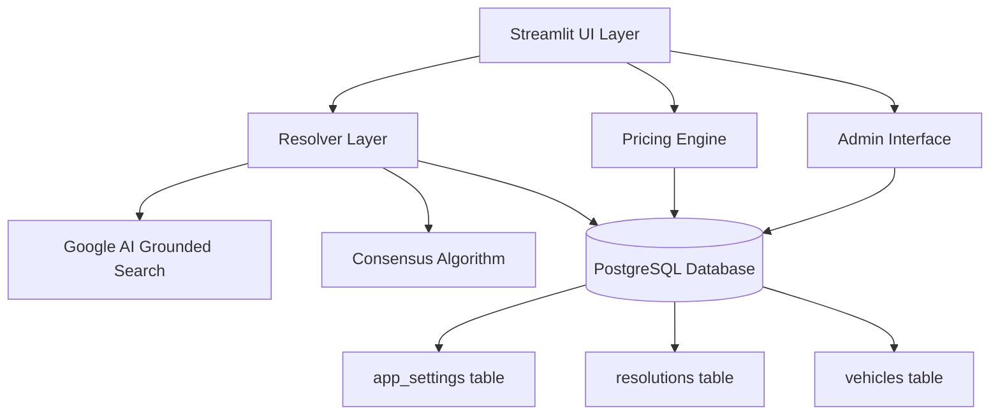

# Design Document

## Overview

The Ruby GEM Estimator will be enhanced to use Google AI with Grounded Search as the primary data source, implementing a consensus-based approach for accurate vehicle component valuations. The system will maintain its current Streamlit-based architecture while adding sophisticated data resolution, provenance tracking, and administrative controls.

## Architecture

### High-Level Architecture



### Component Architecture

1. **UI Layer (Streamlit)**
   - Left panel: Vehicle input form
   - Right panel: Results display with two tables (Sale Value vs Costs)
   - Provenance panel: Source citations and confidence indicators
   - Admin interface: Password-protected settings management

2. **Resolver Layer**
   - Orchestrates Google AI grounded search queries
   - Implements consensus selection algorithm
   - Manages confidence scoring and outlier detection
   - Handles provenance tracking

3. **Pricing Engine**
   - Deterministic calculations with enforced sign conventions
   - Revenue items: ELV steel, engine materials, aluminum rims, catalytic converters, tires
   - Cost items: tow fees, lead costs, nut fees, purchase prices
   - Clear totals: Gross (revenues), Costs (negative), Net = Gross + Costs

4. **Storage Layer**
   - PostgreSQL database with three main tables
   - Maintains existing vehicle data structure
   - Adds resolution tracking and admin settings

## Components and Interfaces

### Resolver Layer Components

#### GroundedSearchClient
```python
class GroundedSearchClient:
    def search_vehicle_specs(self, year: int, make: str, model: str, field: str) -> List[SearchCandidate]
    def get_multiple_candidates(self, query: str, min_candidates: int = 3) -> List[SearchCandidate]
```

#### ConsensusResolver
```python
class ConsensusResolver:
    def resolve_field(self, candidates: List[SearchCandidate]) -> ResolutionResult
    def detect_outliers(self, values: List[float]) -> List[bool]
    def calculate_confidence(self, values: List[float], sources: List[str]) -> float
```

#### ProvenanceTracker
```python
class ProvenanceTracker:
    def create_resolution_record(self, field: str, result: ResolutionResult) -> str
    def get_resolution_history(self, vehicle_key: str) -> List[ResolutionRecord]
```

### Data Models

#### SearchCandidate
```python
@dataclass
class SearchCandidate:
    value: float
    source: str
    citation: str
    confidence: float
    raw_text: str
```

#### ResolutionResult
```python
@dataclass
class ResolutionResult:
    final_value: float
    confidence_score: float
    method: str
    candidates: List[SearchCandidate]
    outliers: List[bool]
    warnings: List[str]
```

#### ResolutionRecord
```python
@dataclass
class ResolutionRecord:
    id: str
    vehicle_key: str
    field_name: str
    final_value: float
    confidence_score: float
    method: str
    candidates_json: str
    created_at: datetime
```

### Database Schema Extensions

#### New Tables

```sql
-- Resolution tracking table
CREATE TABLE resolutions (
    id SERIAL PRIMARY KEY,
    vehicle_key VARCHAR(100) NOT NULL,  -- "year_make_model"
    field_name VARCHAR(50) NOT NULL,    -- "curb_weight", "aluminum_engine", etc.
    final_value FLOAT,
    confidence_score FLOAT,
    method VARCHAR(50),                 -- "grounded_consensus", "database_lookup", etc.
    candidates_json JSONB,              -- Array of SearchCandidate objects
    warnings_json JSONB,                -- Array of warning messages
    created_at TIMESTAMP DEFAULT CURRENT_TIMESTAMP,
    UNIQUE(vehicle_key, field_name)
);

-- Admin settings table (already exists, will be extended)
-- app_config table structure remains the same but will store additional settings
```

#### Extended app_config Settings

```json
{
  "grounding_settings": {
    "target_candidates": 3,
    "clustering_tolerance": 0.15,
    "confidence_threshold": 0.7,
    "outlier_threshold": 2.0
  },
  "consensus_settings": {
    "min_agreement_ratio": 0.6,
    "preferred_sources": ["kbb.com", "edmunds.com", "manufacturer"],
    "source_weights": {
      "kbb.com": 1.2,
      "edmunds.com": 1.2,
      "manufacturer": 1.5,
      "default": 1.0
    }
  }
}
```

## Data Models

### Core Vehicle Data Flow

1. **Input**: Year, Make, Model from user
2. **Resolution Process**:
   - Check database for existing resolution
   - If not found or confidence too low, trigger grounded search
   - Collect multiple candidates per field
   - Apply consensus algorithm
   - Store resolution with provenance
3. **Output**: Resolved values with confidence indicators and citations

### Consensus Algorithm

```python
def resolve_consensus(candidates: List[SearchCandidate]) -> ResolutionResult:
    # 1. Group similar values (within clustering_tolerance)
    clusters = group_by_similarity(candidates, tolerance=0.15)
    
    # 2. Find densest cluster (most agreeing sources)
    primary_cluster = max(clusters, key=len)
    
    # 3. Calculate weighted median based on source reliability
    final_value = weighted_median(primary_cluster)
    
    # 4. Identify outliers (values outside primary cluster)
    outliers = mark_outliers(candidates, primary_cluster)
    
    # 5. Calculate confidence based on agreement and spread
    confidence = calculate_confidence_score(primary_cluster, outliers)
    
    return ResolutionResult(final_value, confidence, "grounded_consensus", 
                          candidates, outliers, generate_warnings())
```

## Error Handling

### Grounded Search Failures
- **Timeout/Rate Limits**: Implement exponential backoff and retry logic
- **No Results**: Fall back to existing database values or manual review flags
- **API Errors**: Log errors and gracefully degrade to cached data

### Consensus Failures
- **Low Agreement**: Flag for manual review with warning indicators
- **No Candidates**: Use fallback heuristics or mark as "needs verification"
- **Extreme Outliers**: Highlight suspicious values for user attention

### Data Quality Issues
- **Invalid Responses**: Validate numeric ranges and reject impossible values
- **Source Reliability**: Weight responses based on known reliable sources
- **Stale Data**: Track resolution age and re-resolve periodically

## Testing Strategy

### Unit Tests
- **ConsensusResolver**: Test clustering, outlier detection, confidence scoring
- **GroundedSearchClient**: Mock API responses and test parsing logic
- **ProvenanceTracker**: Test database operations and record creation

### Integration Tests
- **End-to-End Resolution**: Test complete flow from search to storage
- **Admin Settings**: Test configuration changes affect calculations
- **UI Components**: Test confidence indicators and warning displays

### Performance Tests
- **API Response Times**: Measure grounded search latency
- **Database Queries**: Optimize resolution lookup performance
- **Concurrent Users**: Test system under multiple simultaneous requests

### Data Quality Tests
- **Known Vehicle Tests**: Verify accuracy against manually verified data
- **Edge Cases**: Test with unusual vehicles, missing data, conflicting sources
- **Regression Tests**: Ensure changes don't break existing functionality

## Implementation Phases

### Phase 1: Core Resolver Infrastructure
- Implement GroundedSearchClient with basic candidate collection
- Create ConsensusResolver with clustering and confidence algorithms
- Set up resolution database table and basic provenance tracking

### Phase 2: UI Integration
- Add confidence indicators to existing results display
- Implement provenance panel with source citations
- Create warning banners for low-confidence results

### Phase 3: Admin Interface Enhancement
- Extend admin settings for grounding and consensus parameters
- Add resolution history viewing and manual override capabilities
- Implement Nut fee toggle (ELV vs curb weight)

### Phase 4: Advanced Features
- Implement source weighting and preferred source prioritization
- Add resolution aging and automatic re-resolution
- Create detailed logging and monitoring for data quality

## Security Considerations

### API Key Management
- Store Google AI API key in environment variables
- Implement rate limiting to prevent API quota exhaustion
- Add request logging for audit trails

### Admin Access Control
- Maintain existing password-based admin protection
- Add session timeout for admin interfaces
- Log all admin configuration changes

### Data Privacy
- Store only necessary vehicle specification data
- Implement data retention policies for resolution history
- Ensure no personal information is collected or stored

## Performance Considerations

### Caching Strategy
- Cache resolution results with configurable TTL
- Implement intelligent cache invalidation based on confidence scores
- Use database indexes for fast resolution lookups

### API Optimization
- Batch multiple field queries when possible
- Implement request deduplication for identical searches
- Use connection pooling for database operations

### UI Responsiveness
- Show loading indicators during resolution processes
- Implement progressive disclosure for detailed provenance information
- Use Streamlit caching for expensive operations