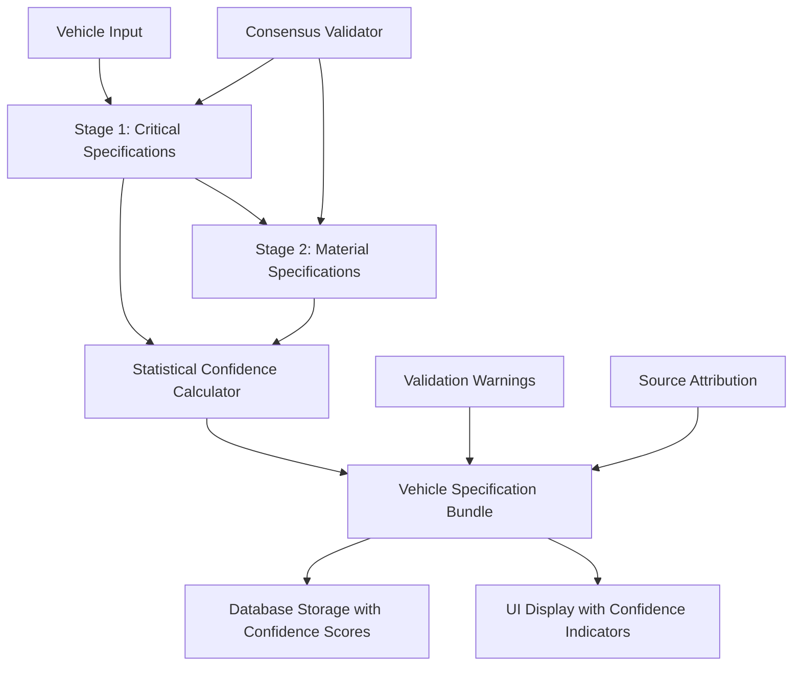

# Staged Vehicle Resolution System Design

## Overview

The Staged Vehicle Resolution System replaces the current single-call and multi-call approaches with a simplified 2-3 stage pipeline that prioritizes accuracy through consensus validation while maintaining performance and simplicity. The system breaks down vehicle specification resolution into focused stages: critical specifications (curb weight and catalytic converters) and material specifications (engine block and wheel materials), with each stage having specific responsibilities and validation mechanisms.

### Design Principles

- **Simplified Architecture**: 2-3 focused API calls per new vehicle search for predictable performance
- **Consensus-Based Validation**: Statistical analysis of multiple data sources with proven reliability metrics
- **Statistical Confidence**: Confidence scores calculated from actual data agreement rather than AI self-assessment
- **Graceful Degradation**: Individual stage failures don't block the entire resolution process
- **Fresh Data Approach**: Make fresh API calls for each new vehicle search without rate limiting concerns
- **Separation of Concerns**: Each stage has a single, well-defined responsibility

## Architecture

### System Components



### Two-Stage Pipeline

#### Stage 1: Critical Specifications
- **Purpose**: Resolve curb weight and catalytic converter count with consensus validation
- **API Calls**: 2-3 focused calls for critical specifications
- **Consensus Logic**: 
  - High confidence (0.90-0.95) when curb weight sources within 50 pounds
  - High confidence (0.85-0.90) when catalytic converter sources agree completely
- **Output**: Curb weight with statistical confidence, catalytic converter count with statistical confidence

#### Stage 2: Material Specifications  
- **Purpose**: Determine engine block and wheel rim materials with cross-validation
- **API Calls**: Additional focused calls for material specifications
- **Cross-Validation**: Check material consistency against vehicle class and brand patterns
- **Output**: Engine block material, wheel rim material, both with confidence scores and source attribution

## Components and Interfaces

### Core Classes

#### StagedVehicleResolver
```python
class StagedVehicleResolver:
    def __init__(self, api_client: APIClient, database: VehicleDatabase):
        self.api_client = api_client
        self.database = database
        self.consensus_validator = ConsensusValidator()
        self.confidence_calculator = StatisticalConfidenceCalculator()
        self.validation_warner = ValidationWarner()
    
    async def resolve_vehicle(self, year: int, make: str, model: str, 
                            user_trim: Optional[str] = None) -> VehicleSpecificationBundle:
        """Main entry point for 2-3 stage resolution with fresh API calls"""
        pass
```

#### StageResult
```python
@dataclass
class StageResult:
    success: bool
    data: Dict[str, Any]
    confidence_scores: Dict[str, float]
    sources: List[str]
    warnings: List[str]
    cache_hit: bool
    api_calls_used: int
    processing_time: float
```

#### VehicleSpecificationBundle
```python
@dataclass
class VehicleSpecificationBundle:
    vehicle_id: str
    year: int
    make: str
    model: str
    trim_level: Optional[str]
    curb_weight: Optional[int]
    catalytic_converter_count: Optional[int]
    engine_block_material: Optional[str]
    wheel_rim_material: Optional[str]
    confidence_scores: Dict[str, float]  # per specification
    overall_confidence: float  # weighted: curb_weight 40%, catalytic 30%, engine 15%, rim 15%
    source_attribution: Dict[str, List[str]]  # detailed provenance tracking
    validation_warnings: List[ValidationWarning]
    stage_results: List[StageResult]
    total_api_calls: int
    processing_time: float
```

### Statistical Consensus Validation System

#### ConsensusValidator
```python
class ConsensusValidator:
    def validate_curb_weight(self, candidates: List[CurbWeightCandidate]) -> StatisticalConsensusResult:
        """
        Statistical confidence based on actual data agreement:
        High confidence (0.90-0.95): Multiple sources within 50 pounds, use median value
        Medium confidence (0.70-0.89): Sources within 100 pounds
        Low confidence (<0.70): Significant disagreement, flag for review
        """
        pass
    
    def validate_catalytic_count(self, candidates: List[CatalyticCountCandidate]) -> StatisticalConsensusResult:
        """
        Statistical confidence based on source agreement:
        High confidence (0.85-0.90): Complete agreement across sources
        Medium confidence (0.60-0.84): Majority agreement
        Low confidence (<0.60): No clear consensus, flag for review
        """
        pass

#### StatisticalConfidenceCalculator
```python
class StatisticalConfidenceCalculator:
    CONFIDENCE_WEIGHTS = {
        'curb_weight': 0.40,
        'catalytic_converter_count': 0.30,
        'engine_block_material': 0.15,
        'wheel_rim_material': 0.15
    }
    
    def calculate_overall_confidence(self, specification_confidences: Dict[str, float]) -> float:
        """Calculate weighted overall confidence emphasizing critical specifications"""
        pass
    
    def calculate_statistical_confidence(self, data_agreement: float, source_count: int) -> float:
        """Calculate confidence from actual data agreement rather than AI self-assessment"""
        pass
```

### Fresh Data Approach

#### Database Storage with Confidence Tracking
```python
class VehicleDatabase:
    def store_specification_bundle(self, bundle: VehicleSpecificationBundle):
        """Store complete specification bundle with confidence scores and source attribution"""
        pass
    
    def get_existing_specification(self, year: int, make: str, model: str) -> Optional[VehicleSpecificationBundle]:
        """Retrieve existing specification for comparison and validation"""
        pass
    
    def flag_for_manual_review(self, bundle: VehicleSpecificationBundle, reason: str):
        """Flag low-confidence resolutions for manual review workflow"""
        pass
```

**Design Rationale**: The system makes fresh API calls for each new vehicle search rather than relying on caching:
- Ensures data freshness and accuracy for business-critical scrap value calculations
- Eliminates cache invalidation complexity and potential stale data issues
- Provides consistent 2-3 API call performance that is predictable and manageable
- Allows for real-time consensus validation with current data sources
- Supports detailed provenance tracking for regulatory and audit requirements

## Data Models

### Statistical Consensus Models
```python
@dataclass
class StatisticalConsensusResult:
    consensus_value: Any
    confidence_score: float
    source_agreement: float
    candidate_count: int
    statistical_method: str  # "median", "majority", "weighted_average"
    flagged_for_review: bool
    
@dataclass
class SourceAttribution:
    source_name: str
    data_value: Any
    reliability_score: float
    retrieval_timestamp: datetime
    api_call_id: str
```

### Specification Models
```python
@dataclass
class CurbWeightCandidate:
    weight: int
    source: str
    trim_specific: bool
    confidence_indicator: str

@dataclass
class CatalyticCountCandidate:
    count: int
    source: str
    engine_specific: bool
    verification_method: str

@dataclass
class MaterialCandidate:
    material: str
    source: str
    vehicle_class_typical: bool
    brand_consistent: bool
```

### Confidence Calculation Models
```python
@dataclass
class ValidationWarning:
    type: str  # "suspicious_combination", "low_confidence", "data_disagreement"
    message: str
    affected_specifications: List[str]
    severity: str  # "info", "warning", "error"
    confidence_threshold_violated: bool
    requires_manual_review: bool

#### ValidationWarner
```python
class ValidationWarner:
    def check_suspicious_combinations(self, bundle: VehicleSpecificationBundle) -> List[ValidationWarning]:
        """
        Generate warnings for suspicious combinations:
        - Lightweight vehicles with iron engines
        - Luxury brands with steel wheels
        - Inconsistent material patterns
        """
        pass
    
    def check_confidence_thresholds(self, bundle: VehicleSpecificationBundle) -> List[ValidationWarning]:
        """Flag specifications below configurable confidence thresholds for manual review"""
        pass
```

## Error Handling

### Graceful Degradation Strategy

1. **Stage 1 (Critical Specifications) Failure**: Continue to Stage 2, mark critical specs as unavailable with low confidence
2. **Stage 2 (Material Specifications) Failure**: Return partial results with available critical specifications
3. **Partial Success**: Always return available data with appropriate confidence scores and validation warnings

### Error Recovery Mechanisms

```python
class StageErrorHandler:
    def handle_api_timeout(self, stage: int) -> RecoveryAction:
        """Retry with exponential backoff, fallback to cache if available"""
        pass
    
    def handle_consensus_failure(self, candidates: List[Any]) -> RecoveryAction:
        """Use best available candidate with low confidence score"""
        pass
    
    def handle_cache_miss(self, stage: int) -> RecoveryAction:
        """Proceed with API calls, log cache miss for monitoring"""
        pass
```

## Testing Strategy

### Unit Testing Focus Areas

1. **Consensus Validation Logic**
   - Test weight consensus with various candidate distributions
   - Test catalytic converter count agreement scenarios
   - Test material validation against vehicle characteristics

2. **Caching Behavior**
   - Test cache hit/miss scenarios for each tier
   - Test expiration policy enforcement
   - Test cache invalidation mechanisms

3. **Confidence Calculation**
   - Test weighted confidence score calculations
   - Test validation warning generation
   - Test statistical confidence algorithms

### Integration Testing Scenarios

1. **End-to-End Pipeline**
   - Test complete resolution with all stages successful
   - Test partial failure scenarios with graceful degradation
   - Test performance with various cache states

2. **API Integration**
   - Test with real API responses and rate limiting
   - Test timeout and error handling
   - Test consensus validation with actual data variations

### Performance Testing

1. **Response Time Targets**
   - Critical specifications stage: 2-4 seconds (1-2 API calls)
   - Material specifications stage: 2-4 seconds (1-2 API calls)
   - Complete resolution: 4-8 seconds total (2-3 API calls)

2. **Reliability Metrics**
   - Target consensus success rate: >85% for critical specifications
   - Target overall confidence: >0.80 for business-critical calculations
   - Target manual review rate: <15% of total resolutions

## Implementation Considerations

### Database Schema Compatibility

The system maintains compatibility with existing database schema while adding new fields for confidence tracking and source attribution:

```sql
-- New fields to add to existing vehicle_specifications table
ALTER TABLE vehicle_specifications ADD COLUMN confidence_scores JSON;
ALTER TABLE vehicle_specifications ADD COLUMN source_attribution JSON;
ALTER TABLE vehicle_specifications ADD COLUMN validation_warnings JSON;
ALTER TABLE vehicle_specifications ADD COLUMN overall_confidence DECIMAL(3,2);
ALTER TABLE vehicle_specifications ADD COLUMN requires_manual_review BOOLEAN DEFAULT FALSE;
ALTER TABLE vehicle_specifications ADD COLUMN api_calls_used INTEGER;
ALTER TABLE vehicle_specifications ADD COLUMN resolution_timestamp TIMESTAMP DEFAULT CURRENT_TIMESTAMP;
```

### Fresh API Call Strategy

- **Predictable Performance**: 2-3 focused API calls per vehicle search with consistent response times
- **No Rate Limiting Concerns**: Fresh calls eliminate complex rate limiting and caching logic
- **Priority Staging**: Critical specifications (curb weight, catalytic converters) resolved first
- **Graceful Degradation**: Continue with available data if later stages fail

### Monitoring and Observability

```python
@dataclass
class ResolutionMetrics:
    total_resolutions: int
    average_api_calls: float  # target: 2-3 calls per resolution
    average_response_time: float
    confidence_distribution: Dict[str, int]  # high/medium/low counts by specification type
    validation_warning_frequency: Dict[str, int]
    manual_review_rate: float
    consensus_success_rate: Dict[str, float]  # by specification type
    source_reliability_scores: Dict[str, float]
```

### User Experience Integration

1. **Confidence Score Display**
   - Display confidence scores alongside each specification in the UI
   - Use visual indicators (colors, icons) to represent confidence levels
   - Provide detailed source attribution on demand

2. **Progress Feedback**
   - Show stage completion progress (1/2, 2/2 for the two-stage pipeline)
   - Display confidence scores as they become available
   - Present validation warnings with explanatory context

3. **Results Presentation**
   - Highlight high-confidence specifications for business decision trust
   - Provide expandable details for source attribution and provenance tracking
   - Flag low-confidence results that require manual review
   - Show API call count and processing time for transparency

4. **Manual Review Workflow**
   - Enable manual review workflows for low-confidence resolutions below configurable thresholds
   - Provide interface for operators to validate and correct flagged specifications
   - Track manual review outcomes to improve future confidence calculations